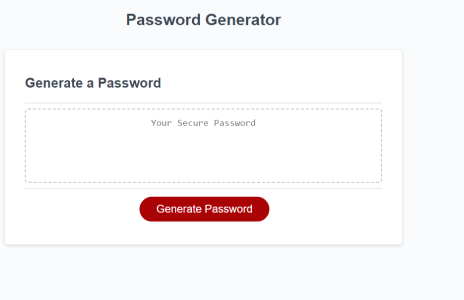

<!-- PROJECT -->
 

  

<h3 align="center">Personal Portfolio</h3>

  

    using html and css
     
    <a href="https://github.com/ryanpauldutton/password-generator"><strong>Explore the docs »</strong></a>
     
     
    <a href="https://ryanpauldutton.github.io/password-generator/">View GH Pages</a>
    ·

  

<!-- ABOUT THE PROJECT -->
## About The Project
  

### Built With
JS
HTML
CSS

### Installation

1. Clone the repo to your local system
2. Access html and css files in VS Code

<!-- USAGE EXAMPLES -->
## Usage

For generating your own secure passwords

<!-- CONTRIBUTING -->
## Contributing

Contributions are what make the open source community such an amazing place to learn, inspire, and create. Any contributions you make are **greatly appreciated**.

If you have a suggestion that would make this better, please fork the repo and create a pull request. You can also simply open an issue with the tag "enhancement".
Don't forget to give the project a star! Thanks again!

1. Fork the Project
2. Create your Feature Branch (`git checkout -b feature/AmazingFeature`)
3. Commit your Changes (`git commit -m 'Add some AmazingFeature'`)
4. Push to the Branch (`git push origin feature/AmazingFeature`)
5. Open a Pull Request

<!-- LICENSE -->
## License

Distributed under the MIT License. See `LICENSE.txt` for more information.

<!-- CONTACT -->
## Contact

GITHUB: [https://github.com/ryanpauldutton/](https://github.com/ryanpauldutton/)

(<a href="#readme-top">back to top</a>)

